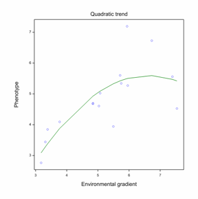
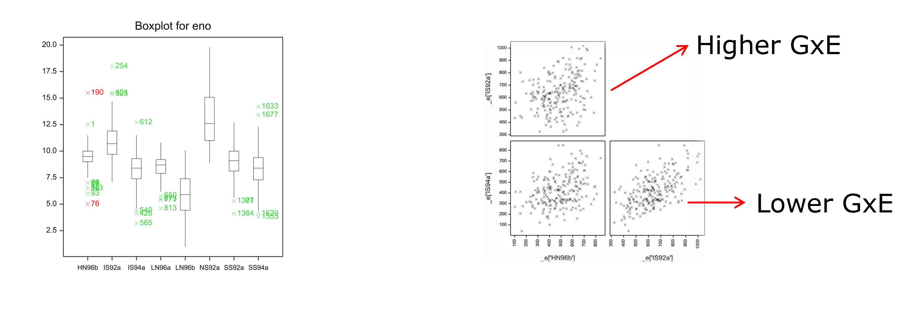

# Basic concepts and definitions

## Phenotype (P), genotype (G) and environment (E)

Let us start basic and define what do we understand by **phenotype**. The phenotype is the ultimate 
expression of a plant characteristic we are interested in because of its economic value for the crop. 
It is what we usually observe, either by measuring it quantitatively or by making some form of qualitative
assessment of it (eg: by giving it a score). Typical examples are the end products of crops, like grain yield in 
cereals, the biomass production in a forage crop, or harvested fruits in vegetable crops. But, what 
is it behind that phenotype? 

The phenotype is the outcome of the crop development that results from the action and interactions between 
genetic and environmental factors as they happened over the entire crop growth development time. In a slightly
more formal way, we can describe the phenotype as a complex function of the **“genotype”**, indicated by 
the letter G, the **environment** indicated by the letter E, over time *t*. 

$$P(t) = \int_0^t f(G, E) dt$$


The G part relates with the DNA composition of an organism, which we know it is much more than just the effect of 
the simple sequence of letters (nucleotides) present in the DNA (i.e. the alleles), as there are interactions between 
alleles within a locus and between loci. We also know that the expression of the DNA has a time dimension as the 
allelic effect can change over time. Therefore, we have to be aware that the genotype is not as a static concept as 
we might initially think. 

The E part includes the effect of everything that surrounds the individual plant (including the other plants!), 
and that we call generically the **“environment”**. Within the environment we include all types of 
external stimuli that a particular individual receives during the life cycle, and conditions the expression
of the genotype. We include here the effect of abiotic factors like temperature, light, humidity, but also 
the effect of other biotic factors interacting with the plants such as pests, pathogens, other plants (weeds). 
Of course the human activity is an important component of the environment via direct intervention, for example, 
in terms of agricultural management practices. 

So, the phenotype results from all these intricate relationships between the genotype and the environment that 
take place during the development or the life cycle. What we will be discussing in this part of the course is
how we can develop models that can help us predicting as much as possible what that outcome (phenotype) would be. 


## P as a G-E function

While we know that the phenotype is a highly dimensional and complex problem, we can try to tackle the problem
by some pragmatic approaches that can help us making decisions. The following equation is one example of a simple
model that can help us as a starting point:

$$ P = E + (G + G \times E)$$

The equation simply describes the phenotype as a "linear model" with three terms, an environmental main effect, 
a genotypic main effect, and a genotype by environment interaction effect. The data that could be described by this model could be represented graphically as in this plot:


```{r, echo=FALSE, out.width="60%", fig.align="center"}

```


Each of the blue dots correspond to the observation (phenotype) of a particular genotype in a particular environment, 
and the height of the dot reflects the value of that phenotype, for example grain yield. If we look at the overall
cloud of dots, we have a sort of surface defined by all the combinations of genotypes and environments. 

In real life it is impossible to observe all possible genotypes and environments combinations, and in fact what we 
actually have is just a sample of genotypes and a sample of environments. But how do we define or choose 
the sample of genotypes and environments? That is a very important question, and to answer that we need introduce two 
important concepts: 

* the target population of genotypes (TPG) 

* the target population of environments (TPE)

The target population of genotypes (TPG) refers to the genotypic range that we want to investigate. These are 
defined by the boundaries of the genetic space that we are working with. For example defined by the germplasm we are 
using in a particular breeding program. Note that the TPG not only includes existing genotypes, but also future 
genotypes. Genotypes that we do not have right now but we can generate by crossings in future. 

The target population of environments (TPE) refers to the range of environmental conditions in which our genotypes are 
expected to grow in future. We develop genotypes that are aimed to perform at certain conditions defined by factors such
as climate, topography, soils, management practices, etc.

Therefore, in any effort to try to understand genotypic performance over environments ("GxE" studies) it is essential to 
clearly define these two components as those define the scope of the study and the conclusions that could be made out of it.

## Reaction norms

Let us now consider just one genotype from the previous plot and represent its performance in a X-Y graph where the X axis 
represents the TPE range from worst to best, and the Y axis the phenotypic response of the genotype, we can observe some functional relationship 
between the phenotypic response and the environmental gradient change. In this particular case a simple linear trend. 


```{r, echo=FALSE, out.width="60%", fig.align="center"}

```


The red line fitting the observations is an example of a reaction norm. Reaction norms define a genotype-specific functional 
relationship between the phenotype and an environmental gradient. Note that in the plot we simply label the axis as 
environmental gradient, but of course that gradient should be quantified in some form, so a relevant question here is indeed 
what drives the environmental gradient and how to quantify it. We can use indexes, but also we could use levels of nutrients, 
water, temperature, disease incidence, etc. Also we could allow different types of functional relationships, for 
example some curvilinear relationship:


```{r, echo=FALSE, out.width="60%", fig.align="center"}

```

At this point we should introduce the term **plasticity**. We say that a genotype shows plasticity when the slope of the reaction 
norm is different from zero, like any of the two ones we observe here. A plastic genotype is a genotype that changes its 
phenotype as reaction to the changes in the environment.

When we compare two or more genotypes a basic question is whether we expect all those genotypes to change in the exact 
same way to the changes in the environment. The answer usually is no, different genotypes can react differently to the same 
environmental change, so they will result in different reaction norms. Whenever reaction norms of genotypes reflect 
differential plasticity, we have **genotype by environment interaction**. Genotypes usually react differently to different 
environments, and that is the reason why GxE is commonly observed. That is also the reason why it is interesting to 
understand the causes behind that differential reactions. What is driving GxE? Which factors drive the environment 
gradient and which are the characteristics of the genotypes that underpin their differential response to those changes?
Understanding these questions will help predicting the performance of different gentoypes in different environmental
circumstances, helping breeders selecting better adapted genotypes and growers growing most suitable materials to their
specific conditions.


```{r, echo=FALSE, out.width="70%", fig.align="center"}

```


A few more on terminology. The upper left plot shows a case of three genotypes that do not show plasticity, their 
phenotype remains constant across the TPE. In this case we **do not observe GxE**. When we move to the plot on the right 
hand side, we do observe plasticity, the three genotypes do show plasticity, but note that the reaction norms are 
parallel, they all react in the exact same way to the changes in the environment. So, while there is plasticity, we **do not** 
**observe GxE** in this case as well. All remaining plots show plasticity, and because the reaction norms are not parallel they 
also show GxE. As you can see there are different types of situations: divergence, convergence, and cross-over. 
Of the three, and from a plant breeding point of view, interactions that involve crossing overs are the most 
relevant ones. This is because the choice of the genotypes will depend on the part of the environmental gradient 
we are. For example, if we look at the two plots in the middle, we observe that the red genotype is always the 
superior one, but if we look at the plots in the bottom left, we see that in some environments the green genotype 
is best but in others is the red one. The difference is that the red genotype has a steeper slope than the green 
genotype. The red genotype shows what we call a higher **adaptability**, that is, a higher ability to become adapted. 
The red genotype is better able to increase in value when the environment improves. In general we make a distinction
between adaptability and sensitivity. We talk of adaptability when the environmental gradient is expresses by some 
form of indirect measure of the quality of the environment, for example the overall mean in that environment. We 
talk of **sensitivity** when the environmental gradient is expressed in terms of a concreate measurable property of 
the environment, for example the temperature, the amount of water in the soil, etc. 


## General versus specific adaptation

General versus specific adaptation are other two terms commonly used in the GxE literature. We can consider a 
genotype as "adapted" when is able to perform at a minimum certain level, for example is able to produce enough
for making the crop profitable. When considering the performance of a certain genotype in a given reference set of 
conditions or TPE there are two possible situations:

* The genotype is able to reach that certain minimum level in the entire TPE range, in which case we would conclude 
that the genotype shows **general adapation** or **wide adaptation**. This is of course the most desirable situation 
as the same genotype can be targeted towards the entire TPE. 

* The genotype is only able to perform above that certain minimum in only part of the entire TPE range, in which case 
we talk of **specific adaptation** or **narrow adaptation**. While this make life more difficult for breeding, it is an 
opportunity as being able to identify and exploit specific adaptation would allow to deliver better adapted genotypes to
specific conditions.


## Stability

Another term commonly used GxE studies is that of **stability**. So far we described the reaction of genotypes to the 
environmental gradients in terms of reaction norms. Reaction norms define the expected response of the genotypes ("the
mean response"), but as always there is uncertainty around that expectation. The variation around the expectation of 
the response that a genotype would give connects with the concept of stability. Stability relates with the 
consistency of the response, and naturally links with the statistical concept of variance. In these plots we see that 
the red genotype on the left shows a higher variation around the reaction norm than the green genotype, so the red 
genotype is less stable than the green one. 

```{r, echo=FALSE, out.width="80%", fig.align="center"}
knitr::include_graphics("./images/Stability.png")
```

## GxE variance and covariance

When looking at the reaction norms of many genotypes, like we have here, we can also look at GxE from the point of 
view of variation and co-variation. For example, if we consider the plot on the left hand side, we observe parallel 
reaction norms, so no GxE. If we consider the range of variation defined by the spread between reaction norms, we 
observe that the variation in poor environment is the same as the variation in the good environments. Note that the 
amount of variation is indicated by the red braces.

```{r, echo=FALSE, out.width="80%", fig.align="center"}

```

However, if we now consider the situation in the right, we do observe differences. The reaction norms are not parallel, 
there is clear GxE, and also we observe that because lines are not parallel the amount of variation can be different 
between environments. For example the amount of variation is lower in the poor environment than in the good
environment, something that is typically observed. We also see crossing overs, so it means that good genotypes in the 
poor environment are not necessarily good ones in a superior environment. Expressed in statistical terms, the correlation 
between performance in poor and good environments is expected to be low. 


We can use simple plots as diagnostics of the presence of GxE. On the one hand we can plot the genotypic means in each 
of a number of environments as boxplots. The width of the boxes shows where the largest 
part of the variation is, from the 25th to the upper 75th quartile. The lines indicate the range of variation and in 
some cases some extreme values are highlighted. We see in this plot that the amount of variation changes from environment
to environment, and immediately triggers the image of non-parallel reaction norms suggesting the presence of GxE in this 
data set. Simple scatter plots of the genotypic means of genotypes in one environment versus the other environment can 
also give some information about the importance of GxE. For example in the scatter plot matrix we see that the plot in 
the right hand side shows a cloud of plots that seems to be positively correlated, we therefore expect low GxE between 
these two environments. However, if we consider any of the other two plots, we observe a rather unstructured cloud of 
points indicating a low correlation between the environments and so suggesting a stronger GxE between those pairs of 
environments. In some cases the correlations can be even negative, in which case will point to even stronger GxE.  


```{r, echo=FALSE, out.width="100%", fig.align="center"}

```


