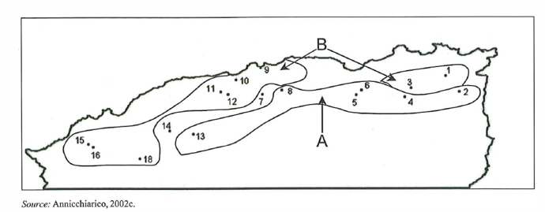
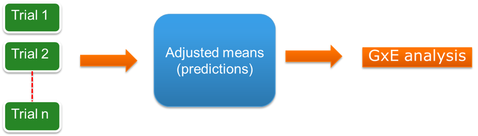

# MET and basic statistical models

## Multienvironment trials (MET)

GxE data or multi-environment data is information that we obtain by observing the performance of some genotypes in several 
conditions or environments. For example in the figure here we have an example of a network of trials 
conducted in Algeria, where a number of genotypes, in this case 24 wheat genotypes were evaluated in 22 different 
environments. In fact, the 22 environments can be further partitioned into 11 geographical sites and 2 
years, so, a trial was run in each of the 11 sites in two consecutive years. This is an example of a so-called 
multi-environment trial or MET. Of course each trial has to be designed following an adequate 
experimental design, in this case each trial was set up as a randomized complete block design.


```{r, echo=FALSE, out.width="80%", fig.align="center"}

```

Series of trials like the one we have just introduced are useful to evaluate the response of genotypes across 
a range of environmental conditions. We do that, because we expect that genotypes will react differently to the 
environmental gradient represented by the environments used in the experiment. This is to say, that we expect GxE. 
By analysing the data from such a trial, we can characterize the response of the genotypes for example in terms of
reaction norms, which can be useful to predict the performance of those genotypes in other environments. Recall 
that a first important thing to consider when setting up a trial system like this one is to define the target 
population of genotypes (TPG) and the target population of environments (TPE). These are the two main dimensions of the 
data set. 

The target population of genotypes represent the genetic background we want to evaluate because we are interested in.
In general we use a sample from a larger theoretical population as we can not or we do not want to evaluate all 
possible genotypes. The set of genotypes can have some internal structure, for example in terms of genetic
relationships or pedigree relationships. In other cases, the set might be unstructured, for example if we 
evaluate a segregating population like an F2 or a double haploid population.

On the environmental side, the same applies. The conditions we choose to use in the trialling system are based on 
what are our expectations in future. These should be representative of the conditions that we expect our genotypes 
to face in future. Again, the set of conditions might be completely unstructured or there might be some internal 
structure. For example, sites might be grouped by some common properties like soil types, altitude, drought stress,
etc.

The choice of conditions can essentially follow two strategies: 

* we can define specific conditions by management, for example setting up a trial where the amount of irrigation will be controlled to make sure that different levels of water stress will be imposed, or the amount of some nutrient controlled, radiation, etc. These are called **managed stress trials**. Nowadays there available all types of phenotypic platforms that are useful to evaluate genotypic responses under very specific conditions. 

* we can establish series of trials over a number of locations and years or **multi-environment trial networks**. The idea here is to include locations that are representative for example of the different production areas and then using several years as a way to sample year-to-year variation.

## Typical research questions on GxE

What are the typical research question that we want to address with MET data? With GxE data we can answer questions 
related with genotypes on the one hand, and questions related with the environments. Many times we have several 
simultaneous questions to answer as well.

* Regarding genotypes, we might want to investigate the adaptation of the genotypes, how well do certain genotype 
perform under a particular condition, or range of conditions. Is a genotype widely adapted or not? Or does a genotype show particular capacity to become adapted when conditions improve? How consistent is the performance of a genotype over a range of conditions? Or in other words, how stable the performance of a genotype is?

* On the environmental side, we might want to answer questions that can help improve the testing network. For example, 
can we group the environments into more homogeneous sets of environments? In other words trying to identify structure 
in the environmental range within our TPE. This question can lead to decide for example, to split the TPE into sub-groups and target the breeding program towards those sub-groups. This questions can have help in shaping the strategy of a breeding program. Can also help tactical decisions of the MET, for example on how to optimize the choice of trials to include in the network and for how long (years) should testing be done. 

## One-stage analysis for MET data

In terms of analysis, there are essentially two main strategies for modelling GxE data. A first one is the so-called 
**one-stage analysis**. In a one-stage analysis (sometimes also called one-hit models) we use all the data 
simultaneously. That is, we combine the plot information across all environments and fit a statistical model to it. 
A desirable feature of this option is that we use all the available information. 

A classical text book model for a GxE analysis would be as follows (here and in the rest of the document we will underline random variables and terms in the model):

$$\underline{y}_{ijk} = \mu + G_i + E_j + B_{k(j)} + GE_{ij} + \underline{e}_{ijk}$$

The model is again a linear model and tells us that the response $y_{ijk}$ is the result of an intercept, a genotypic main effect, 
an environmental main effect, a block effect (nested within environment), a genotype by environment interaction effect 
and a residual. For the residual we assume random effects normally distributed with variance parameter $\sigma^2$, or in short $\underline{e}_{ijk} \sim N(0, \sigma^2)$. This is a simple model that comes along with a number of strong assumptions:

* the error variance is assumed constant
* the variation and co-variation between environments is assumed to be simple
* we assume the same design was used in all the environments (in this case a randomized complete block design). 

If some of these were not true, then of course the model can be modified to allow for other types of effects, for example
to model incomplete block effects given by row and column coordinates, and even model some spatial variation within 
each trial. At the same time, this will imply an increaingly complex model that while still possible might come with some 
additional challenges (eg: model fitting convergence issues).

$$y_{ijk} = \mu + G_i + E_j + Rep_{k(j)} + Row_{r(k,j)} + Col_{c(k,j)} + GE_{ij} + \xi_{ijk} + e_{ijk}$$


## Two-stage analysis for MET data

A second alternative when analysing GxE data is to go for a **two-stage analysis**. This diagram represents the idea graphically:

```{r, echo=FALSE, out.width="80%", fig.align="center"}

```

In a two stage analysis we split the task in two parts:


* First stage where the focus is on the analysis of each individual trial separately. Here we pay special attention to the modelling of 
the design issues of a particular trial, being able to go to the very 
specific details of it. We can use it as a stage of quality control of the data, identifying potential problems with the data such as outliers or strange observations. The result from this stage are adjusted means per genotype or **Best Linear Unbiased Estimates** (BLUEs in short).
So each genotypes ends up with a value in that particular environment. This is repeated for each of the trials in the MET and combined in a single new data set of adjusted genotypic means that will be carried forward to the next stage.

* Second stage, where the data consists of the adjusted means coming out of the first stage (blue box in the diagram). 
In this stage we change the focus towards the modelling of GxE. Here the objective is to characterise the response of the 
genotypes along the environmental gradients in terms of different parameters, that we will connect to either the 
genotype or the environments. 


## Modelling GxE

Let's focus on a two stage analyisis of GxE. A basic model for the second stage would be:

$$\underline{y}_{ijk} = \mu + G_i + E_j + (\underline{GE}_{ij} + \underline{e}_{ijk})$$

Note that because in the second stage we start with one observation per genotype and environment combination the response variable is indexed by i and j only, that is genotypes and environments, and we do not include replicates. 
Because of that, we can not really separate the last two terms, the GxE and the error and that is why they are presented between brackets. The rest of the model looks familiar, we have an intercept, a genotypic main effect, and an environmental main effect. The GxE forms part of the residual, and to emphasize that we underline the term 
to make it clear that is a random effect. Strictly speaking, the GxE and the error variation can be separated by using weights calculated in the first stage of the analysis, but here we are not going to discuss that type of analysis.

To make it more clear and explicit that GxE and true error are together we can rewrite our basic model equation as follows: 


$$\underline{y}_{ijk} = \mu + G_i + E_j + \underline{\epsilon}_{ij}$$

which is exactly the same as before, but now $\underline{\epsilon}_{ij}$ represents the residual that lumps both GxE and error random effects. Now, with this model formulation, and with the GxE being part of the residual we have a purely additive model. So, we can not really do much with the GxE here. It is a starting point, but we will need to carry on with the modelling 
exercise. The main objective will be to move as much of what now is in the residual and that contains GxE variation 
into the fixed part of the model by adding extra terms. In addition, we will want that those extra parameters that 
enter the model to describe GxE depend exclusively on the genotypes or on the environments. The exclusive dependency
on the genotype or on the environments is called **separability** and it is desirable because identifying parameters 
that depends on one or the other means that we can modify either the genotypes or the environments to obtain a 
desirable response, so we will have more control on the system and gain in our ability to make predictions. 

We finish this part with a snap shot of the models that will be discuss later on.

### Full factorial ANOVA {-}


$$ \underline{y}_{ijk} = \mu + \color{red}{G_i} + \color{green}{E_j} + (\underline{GE}_{ij} + \underline{e}_{ijk})$$
The full factorial model actually means an additive models since the GxE is simply part of the residual variation. 
In this model we have 
two parameters that are either index by i or j. One is the genetic main effect $G_i$ index by i, and the other one is the environmental main effect index by j ($E_j$). In red we colour parameters that are related with the genotypes, and in green those related with the environments.


### Finlay Wilkinson model {-}

$$\underline{y}_{ijk} = \mu + \color{red}{G_i} + \color{green}{E_j} + \color{red}{\beta_i}\color{green}{E_j} + 
  \underline{\epsilon}_{ijk}$$


The Finlay-Wilkinson model that we will discuss 
shows an extra term $\beta_i$ in red and index by genotypes, and a term $E_j$ that is index by j, so environmental. 
Here we have an example of an extra term in the model that has parameters that are either genotypic or environmental.


### AMMI model {-}

$$\underline{y}_{ijk} = \mu + \color{red}{G_i} + \color{green}{E_j} + \sum_{k \in K}\lambda_k\color{red}{u_{ik}}\color{green}{\nu_{jk}} + \underline{\epsilon}_{ijk}$$

The AMMI model, that is 
the next model shows a similar form, but this time the summation indicates that we have several terms, each one 
with a parameter in red and another one in green, again genotypic or environmental.

### GGE model {-}
$$\underline{y}_{ijk} = \mu + \color{green}{E_j} + \sum_{k \in K}\lambda_k\color{red}{u_{ik}}\color{green}{\nu_{jk}} + \underline{\epsilon}_{ijk}$$

The GGE model is similar to 
the AMMI model but within the multiplicative term the genotypic main effect is included as well. Again, all terms are 
either red or green.


### Factorial regression model {-}
$$\underline{y}_{ijk} = \mu + \color{red}{G_i} + \color{green}{E_j} + \color{red}{x_i}\color{green}{\alpha_j} + 
  \color{red}{\beta_i}\color{green}{Z_j} + \underline{\epsilon}_{ijk}  \\$$

Finally the factorial regression model uses different types of explicit genotypic or 
environmental information indicated by $x_i$ and $Z_j$ respectively, and are associated with parameters that are environmental or genotypic (or red or green). 

Note that what is common across all of these models is that they all try to model the residual of our starting additive model, which implies trying to extract as much as possible the underling $GE_{ij}$ effects by using a number of parameters that are either genetic (red) or environmental (green). Again, this is what we called before separability. If we can control the genotypes, we can control the variation of the parameters that are genetic (eg: via the use of QTLs and 
molecular markers or regular selection). Also if we know how to control the environmental parameters we can 
modify the environment in the most suitable way.