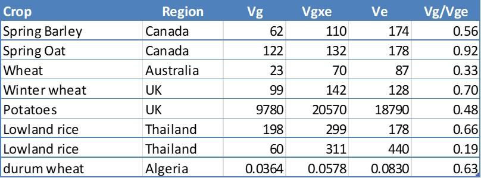
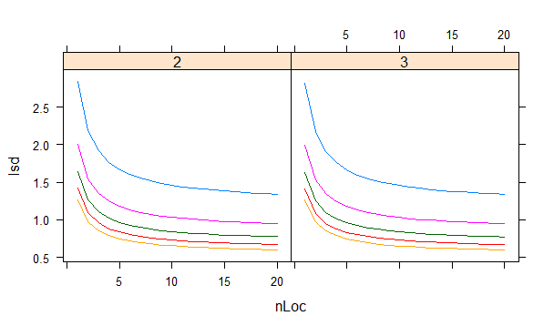

# Variance components models

## A motivating example 

Let consider a multi-environment trial network consisting of 30 genotypes evaluated in 50 environments. The 50 environments
consist of 10 different locations that have been used over 5 years. Each trial has been designed following an RCBD.

The data in R looks like this:

```{r, echo=FALSE}
load("./data/Simulated Data.RData")
GxEsim
``` 

with one column for the genotypes, one column that identify the location, one for the 
year, the column environment results from the combination of location and years, so the first environment is location 1 
in year 1, then a column for the blocks, and finally the response variable that could be for example yield. 

A basic model for this data is a classical two-way anova with blocks  (remember random terms underlined). 

$$\underline{y}_{ijk} = \mu + G_i + E_j + B_{k(j)} + GE_{ij} + \underline{e}_{ijk}$$

The response, grain yield is the result of an intercept, the genetic main effect, the environment main effect, block effect within the environment (blocks are 
nested within environments), an interaction effect genotype by environment and finally a residual. We take the usual 
assumption for the residual, that is independence, normal distribution and constant variance sigma $\underline{e}_{ijk} \sim N(0, \sigma^2)$. This is a fixed effects model and requires to estimate a parameter for every genotype and environment combination, and so 
requires that all G-E combinations are present at least once in the data for estimation. It also assumes constant residual variance 
(i.e. we are assuming that the error variance is the same in each of the environments). 

We can fit the model with R and get the following ANOVA table. 

```{r, cache=TRUE}
# Fit a two-way anova
m1 <- lm(yield ~ Geno + Env/Block + Geno:Env, data = GxEsim)

# Display ANOVA table
anova(m1)
```


The interpretation of the ANOVA table should start by assessing whether the GxE interaction is significant or not. We find 
that according to the F test statistics and the P value there is a highly significant interaction. 
However, if we look at the main effects as well, we also see that the effect is highly significant. In fact if we look 
a the F test statistic it is clear that the environmental main effect seems to be the most important. That is indeed true 
in most of the cases, the environmental main effect tends to dominate the variation in most multi-environment data, but that 
is less interesting from a plant breeding point of view. For a breeder it is more interesting to evaluate the importance 
of the variation associated with the genetic main effect and the genotype by environment interaction. But is the F test 
the best way to look at it? 

When trying to quantify the importance of GxE is more interesting to compare **sources of variation**, so for example look at
the sum of squares for genotypes and for genotypes by environment, or perhaps better look at the means squares. In fact, and
from a plant breeding point of view neither sums of squares nor mean squares are interesting, what is interesting are the 
variance components. The genetic variance component and the genotype by environment variance component. We want to look at 
the decomposition of the genetic variation. To obtain variance components, we need to switch the model, we need to move to 
a mixed model, in which genotypes are taken random.

## A basic mixed model for GxE

A different view of the same data can be made by changing our model into this one:

$$y_{ijk} = \mu + \underline{G}_i + E_j + B_{k(j)} + \underline{GE}_{ij} + \underline{e}_{ijk}$$


The main difference in this model is that we take genotypes random (underlined now) and because genotypes are taken random we 
also imply that the genotype by environment interaction effect is random (***rule: the interaction between a random factor and a fixed factor is always random***). Same as we did for the error variance we have to make assumptions about the distribution of the random effects, we now have to define our assumptions regarding the distribution of the random effects: for genotypes is $\underline{G}_{i} \sim N(0, \sigma^2_G)$ and for the interaction $\underline{GE}_{ij} \sim N(0, \sigma^2_{GE})$. So, the model involves the estimation of 
three variance components, the residual variance component as before, but now we add the genetic variance component $\sigma^2_G$ and the genotype by environment $\sigma^2_{GE}$ variance component. 

These last two are the main parameters of interest, and can be used to quantify the importance of GxE. We have to note that 
this model releases the restriction of requiring balanced data, something that can happened in real life applications. So, 
also a better model for GxE data in this respect.

We can fit this model with R with the ```lmer()``` function of the lme4 package. What is different in the syntax with respect to the model specification using the regular ```lm()``` function, is that now we have to tell explicitly which terms are random by using the expression between curved brackets with the term that is random.

```{r, echo=TRUE, cache=TRUE, message=FALSE}
# Fit genotypes random
m2 <- lmer(yield ~ Env/Block + (1|Geno) + (1|Geno:Env), data = GxEsim)

# Print table of estimated variance components
print(VarCorr(m2), comp = "Variance")
```

We now see in the output a summary of the estimated variance components. We see that the variance component 
for the genotype by environment interaction has been estimated as 0.93, and the one for genotypic main effect 0.11, a much lower
value. The residual variation is the largest with 3.96. If we compare the magnitude of the variance components we can observe that 
the GxE variance component is much larger than the G variance component, pointing to a large GxE in this data set. 
 
In a variance component model like this one there is a correlation structure or dependency implied. The correlation between 
observations is defined by the shared levels of the random terms. For example, the expression of the correlation between observations 
of the same genotype across the environments is given by the ratio of the genetic variance component over the total variance. 

$$r = \frac{\sigma^2_G}{\sigma^2_G + \sigma^2_{GE} + \sigma^2_e}$$


In this case that correlation is quite low ($r = 0.02$ - try getting to this value by hand). This low correlation is in part because 
of the large residual variance but also because of the relative large GxE variance in comparison to the residual variance.

What others have found? The table here shows some results extracted from different papers. 


```{r, echo=FALSE, out.width="80%", fig.align="center"}

```


These are but few examples, but it is 
worth to notice some patterns. In the first place, in general the GxE variance component is larger than the genetic main effect 
variance component. Measured in terms of Vg / Vgxe ratio as shown in the last column we observed that is always lower than 1, 
meaning the GxE is larger than the G variance. Residual variance is in general quite important as well. However, the importance 
of GxE depends, in some cases is more important than in others, for example in the spring oat example, second in the list the 
genetic variance and the genotype by environment interaction are quite similar.

So, we discussed here a first simple mixed model for multi-environment data, and how to quantify the importance of GxE. A mixed 
model as a better alternative than a classical fixed two-way ANOVA model in the first place. Then we look at the variance 
components to quantify the importance of GxE and found that in our example, but also that of others, the variance component for
GxE is larger than the one associated with main effects.

## Partitioning GxE

In the previous section we started with a model considering the **environments** as the combinations of locations and years.
In this part we are going to further develop the model partitioning the environment into its components (locations and years).
We update the model to the following:

$$\underline{y}_{ijk} = \mu + \underline{G}_i + L_m + Y_n + LY_{mn} + B_{k(j)} + \underline{GL}_{im} 
  + \underline{GY}_{in} + \underline{GLY}_{imn} + \underline{e}_{ijk}$$


The model now splits the environment main effect into a location and year main effect plus a location by year interaction effect.
This still is an environmental effect that is of no particular importance to us as breeders. However, the important part 
comes further on the GxE part. The GxE is now partitioned into a genotype by location interaction, a genotype by year 
interaction, and a three-way interaction genotype by location by year interaction. These last three terms are random since we 
assume genotypes as random. The interesting part is that now we will be able to quantify the relative importance of each of 
these subcomponents of the GxE. In this way we can gain insights on the GxE as we will have different interpretation/explanation 
of the interactions. An genotype by location interaction is explained by different causes than a genotype by year interaction. Genotype
by location interaction could be related with soil characteristics, altitude, etc, while GxY will probably link with the weather 
conditions that happened to occur in the different years. This information can be very valuable to re-design evaluation networks, for 
example to decide to include more locations or to evaluate in more or less years.

A little more on the different interpretation of the components of GxE. In general we tend to associate genotype by location 
interaction with the differential response of genotypes to conditions that **are particular** to a location. However, in the case 
of genotype by year interaction, that interaction will arise as consequence of the differential reaction of the genotypes to 
the conditions that **were particular** to a certain year or season. Similarly, the three-way interaction, that is the most 
complex interactions, result from the differential reaction of the genotypes to the conditions that **were particular** for a given 
location / year combination. Note the difference when referring to GxL we use the word “are”, as opposed to “were” that is associated 
with GxY and GxLxY. What is behind that subtle difference? The difference suggest something that is very important to consider in any
GxE study: **are we looking at repeatable or non-repeatable effects?**. 

Not that exists a clear-cut between the two, but in general we tend to associate GxL with 
a more repeatable source of variation than that of GxY or GxLxY, since we can attach or relate those interaction effects with properties 
of the sites that we expect to be present every time we grow a crop there. For example, if a genotype does relatively better 
than other on sandy soils than on clay soils, every time we compare these two varieties on both types of soils, we expect the 
same interaction to be observed, we expect a repeatable interaction. However, if the interaction is caused by conditions that 
are proper of a year, for example a dry year or a warmer year, since we don’t know if the following year will be dry or warm 
again, the relative performance of genotypes will be hard to predict. In that sense, the difference between a repeatable interaction 
and a non-repeatable interaction is important from a plant breeding point of view. If repeatable, we can exploit, for example 
target the right genotype for a sandy or a clay soil, if unrepeatable we need to live with it, and the interaction will form 
a sort of noise we have to handle. The breeding strategy will be probably different, as we will then try to get a genotype that 
on average does well across all years for example.

So, in terms of parameters, on the one hand we will partition the environmental main effects, but that is less relevant, and 
we will partition the total GxE variance into a variance due to genotype by location, a variance due to genotype by year, and 
a variance due to genotype by location by year interaction. These three variances together will make the total GxE variance. 
In general we would relate GxL as the part of GxE variation that is more repeatable, but of course that is in general and not 
necessarily the case.

We can fit the model in R, using the lmer( ) function and in our example we obtain the following variance component estimates. 

```{r, echo=TRUE, cache=TRUE, warning=FALSE}
# Decompose the environment in L & Y
m3 <- lmer(yield ~ Loc*Year + Loc:Year:Block + (1|Geno) + 
             (1|Geno:Loc) + (1|Geno:Year) + (1|Geno:Loc:Year), 
           data = GxEsim)

# Print table of estimated variance components
print(VarCorr(m3), comp = "Variance")
```

As we can see the most important variance component is the complex three-way interaction, which is not ideal because that is
a difficult type of interaction to work with. At the same time, not large surprise since this is quite often the case. The 
genotype by year interaction is the next in importance, also a type of non-repeatable GxE, and finally the GxL is very small. 
Do note that the variance GxL being very low does not mean that there is no GxL interaction! What it means that the GxL 
interaction changed between years, so for example in some years some genotypes did better than others in some locations but 
the other way around happened in a different year. So the rankings of genotypes across locations seem to have changed from 
year to year (genotypic performance across locations is not stable across years).


## Design MET networks

We mentioned before that a GxE analysis can provide information to re-design or evaluate a trial network. 
Let's consider the usual case when we want to compare the performance of a set of genotypes in a range of environments. The 
expression of the variance of a genotypic mean coming out of a multienvironment trial is a function of the different sources
of variation in the data:

$$\sigma^2_{\hat{y}_i} = \frac{\sigma^2_{GL}}{n_L} + \frac{\sigma^2_{GY}}{n_Y} + \frac{\sigma^2_{GLY}}{n_Ln_Y} + 
   \frac{\sigma^2}{n_Ln_Yn_r} +$$ 


Each of the GxE variance components enters the equation of the variance of the mean and are weighted by the number of locations, 
years, and replications. The variance of a mean defines the precision with which we will be able to compare means in a network. 

Let see how this translate in our example data set. We first fit a mixed model with the genotypes as fixed to get all the variance
components that enters in the calculation of the variance of a mean:

```{r, echo=TRUE, cache=TRUE, message=FALSE}
# Fit a model with genotypes fixed
m4 <- lmer(yield ~ Loc*Year + Loc:Year:Block + Geno + 
             (1|Geno:Loc) + (1|Geno:Year) + (1|Geno:Loc:Year), 
           data = GxEsim)
```

The tibble contains the estimated variance components ("vcov") and the column "denom" is the denominator by which each 
variance component will be divided according to the formula of the variance of the mean:

```{r}
# get variance components
vcomp <- as_tibble(VarCorr(m4)) |> select(grp, vcov) |>
  mutate(denom = c(50, 10, 5, 150))

# display the variance components
vcomp
``` 

which leads to the following estimation of the variance of the mean (or the standard error of the mean by just taking the square root of it)

```{r}
# Variance of the mean
summarise(vcomp, varmean = sum(vcov / denom))


# or the standard error of the mean by just taking the square root of it
summarise(vcomp, se = sqrt(sum(vcov / denom)))
```

which is exactly what we get when we ask for it using R:

```{r, message=FALSE, cache=TRUE}
# get adjusted means and compare results
adjmeans <- emmeans(m4, specs = "Geno")
as_tibble(adjmeans)
```


If we consider that the objective of the network is to arrive at the right decisions, for example to prefer one genotype over the
other, then it is clear that is important to have the right precision in those comparisons. From the expression we see that 
increasing the number of locations and/or years, as well as the number of replications per site-year will lead to a higher
precision. However, that increase comes at a cost (field experiments are very expensive!). Therefore it is important to find the right balance between the needed in precision and the cost to reach that particular level of precision.

### The LSD as measure of precision {-}

A way to look at the problem is to use the Least Significant Difference (LSD) as a reference. The LSD is the minimum difference that
the network allows to differentiate any two genotypic means. The lower the LSD, the higher the precision is (small LSD means that the
network allows to differentiate genotypes that differ by a smaller difference). The expression of the LSD is:


$$LSD = 2 \times sed_{y_1, y_2}$$

with sed being the **standard error of a difference** between two means $y_1$ and $y_2$, which is estimated as:


$$sed_{\hat{y}_1, \hat{y}_2} = \sqrt{2 \times \sigma^2_{\hat{y}}-2\times cov(\hat{y}_1, \hat{y}_2)}$$

In our example, we found out the variance of the mean = 0.0788, which leads to the following estimate $sed = \sqrt{2 \times 0.0788} = 0.397$, and so $LSD = 2 \times 0.397 = 0.794$. We conclude that with our current network we are able to detect a difference of 0.8 ton/ha
in yield. Is that good enough? The answer to this question is not a statistical one but is a pragmatic one as it depends on the concrete application. A breeder needs to consider if that precision will be helpful or not to make his decisions in the program.

```{r, cache=TRUE}
pairs(adjmeans) |> as_tibble()
``` 


With the estimated variance components we can plug different values for the number of locations, years and replications and generate
an overview of the precision of different network configurations. For example the following plot shows the expected precision of networks
that include either 2 or 3 replications per field (left and right panel), different number of years (line curves) and different number of
locations (X axis in the plots).


```{r, echo=FALSE, out.width="80%", fig.align="center"}

```

First we see that adding locations in the network increases the precision (the LSD becomes lower), but the gain is mostly up to 10
locations or so (gains are marginal beyond 10 locations). However, the gains are less after say 5 to 10 locations. 
We also observe that adding years increases the precision (blue line = 1 year, purple 2 years, green 3 years, red 4 years, and orange
5 years). Again, the gain in precision is mostly up to 3 years of trialling. The effect of replications per site is shown by comparing
the same line between the right and left panel. 

To compare the different scenarios, we need to consider as well the total amount of resources invested per genotype. For example, having
a network with 10 sites, 2 replications per site and during 3 years, it means a total investment of $n_{sites} \times n_{replications} 
\times n_{years} = n_{plots}$ to test every genotype. Each plot has a cost in euros, which a breeder will consider at the moment to define
the set up of the network (there will be a budget that will put limits to how much resources could be put in the network).


## Summary

So, and to summarise, we first discussed a further partitioning of the GxE variance into genotype by location, genotype by year, 
and genotype by location by year interaction. Discuss these types of interaction variances in terms of repeatable and 
non-repeatable GxE and its implications for plant breeding. And finally we saw an example of how the estimated variance 
components can be used to evaluate the precision of a trial network and propose alternatives to it.
