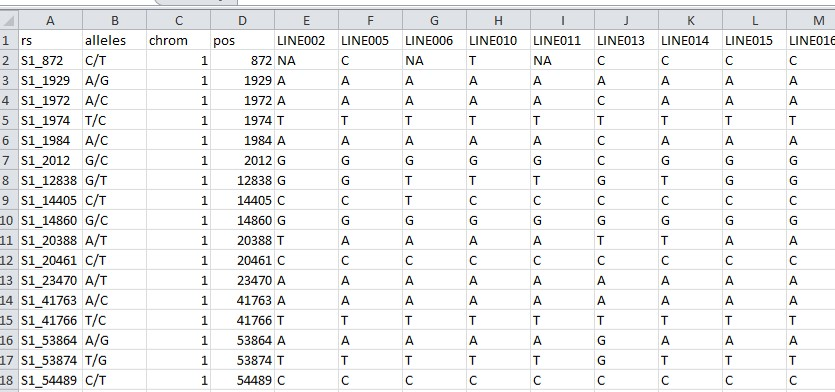

# Factorial regression models


Finlay Wilkinson, AMMI or GGE models all have in common that they do not require explicit environmental information. We can apply these models purely based on the phenotypic data. The trick is that these models use the response variable itself to construct environmental indexes that characterize environments. In other words, they use the genotypes to tell us how good or bad an environment is, or how similar or different two environments are. The environmental information is there but is implicit in the data, and so we can say that these models use implicit environmental information. 

On the one hand, this is an advantage because we can fit these models without the need of additional information. However, the draw back of the approach is that it is not always easy to understand or interpret those indexes. For example in the AMMI model the environmental indexes are constructed following a mathematical approach that assures that the maximum of variation is explained on a lower dimensional space, but how that connects with the biology is far less clear. Those indexes do not necessarily have a clear interpretation in biological terms, which makes prediction for unobserved environments more difficult or impossible unless we are willing to to accept quite strong assumptions.

There is where factorial regression models that incorporate explicit environmental and/or genotypic information become more interesting, and is the subject we will discuss in this part.

## Use of explicit environmental information

Nowadays all kind of devices with different types of sensors are available that can be used to collect a lot of information from an environment. We can keep track on the temperature, humidity, radiation, and other features at a daily basis or any other period of time. Collecting this type of information has been becoming increasingly important in plant breeding, even creating a new term to identify it: "envirotyping", which adds to the classical phenotyping and genotyping. 

There are plenty of advantages of using explicit information when modelling phenotypic responses in the TPE, but essentially all converge to the fact that the predictability of the model improves because it become more general and potentially closer to the biology of the crop. The area opens plenty of opportunities for the closer integration in breeding of plant and crop physiology, genetics, and statistics.

But how do we integrate explicit information in the statistical model? This is what we are going to develop now. 

## Factrorial regression models

We start by defining a basic expression of a factorial regression model:

$$\underline{y}_{ijk} = \mu + \color{red}{G_i} + \color{green}{E_j} + \sum_{k \in K}\color{red}{\beta_{ik}}\color{green}{Z_{jk}} + \underline{\epsilon}_{ijk}$$

When you look at it, the formulation looks very similar to the one of the AMMI model, the main difference being that the model now contains an explicit characterization of the environment as covariates or predictor $Z$ instead of an index derived from the data itself. The environments are characterized by tangible properties $Z_j$, such as temperature, humidity, radiation, and the response of the genotypes characterized by their sensitivity $\beta_i$ to the changes of environmental properties. The model can contain one or more environmental covariables, and the trend might be linear or can take other shapes, like curvilinear relationships.


## Maize example revisited

Let's return to our maize example. The following graph shows the environments as characterized by two explicit environmental covariables, the minimum temperature during flowering time (a moment where the crop is particularly sensitive to it) and the radiation during grain filling important for realization of the yield potential. 

```{r, echo=FALSE, fig.width=8, fig.align="center"}
p1 <- ggplot(maize_covars, aes(x = mintf, y = radg, colour = Env)) +
  geom_point(size = 3, alpha = 0.6) +
  labs(x = "Minimum temperature during flowering",
       y = "Radiation")
ggplotly(p1)
```


From the plot we see that the environments differ in their properties. Most of the environments are relatively cool during flowering time except forLN96a that is a bit intermediate, and HN96b and LN96b that are clearly warmer. We also see a gradient in radiation, with some at a low level, HN96b and LN96b intermediate, and IS94a and SS94a at a high radiation level. The question we want to answer with this data is whether those differences can be associated with the differential response of the genotypes, and so can be used to explain GxE patterns.

Below a model that relates the response of the genotypes with the minimum temperature during flowering. It is a simple linear model including the temperature as covariate, which can be fitted as shown: 

$$\underline{y}_{ijk} = \mu + \color{red}{G_i} + \color{green}{E_j} + \color{red}{\beta_i}\color{green}{Temp_{j}} + \underline{\epsilon}_{ijk}$$


```{r}
# add environmental information to the data
dat <- left_join(maize, maize_covars, by = "Env")
# fit factorial regression model
FRminTF <- lm(yield ~ Geno + Env + Geno:mintf, data = dat)
anova(FRminTF)
```

In the resulting ANOVA table we see that indeed the temperature significantly explains the differential reaction of the genotypes in the TPE, with a significant genotypic sensitivities or slopes (the term indicated as Geno:mintf in the table). We conclude that genotypes do show a significant differential sensitivity to minimum temperature during flowering, which partially explain GxE. Remember that the sums of squares for GxE was 813.2 (residual from the additive model), so the reaction to minimum temperature explains $\frac{172.3}{813.2} \times 100 = 21\%$ of the GxE. 

Here we see the results in a plot, with the different frames corresponding to the reaction of the different genotypes. 

```{r, echo=FALSE, message=FALSE, fig.width=8, fig.height=5}
dat$fit_temp <- fitted(FRminTF)
selG <- c("G001","G005","G019","G028","G060", "G128")
toplot <- filter(dat, Geno %in% selG)

ggplot(toplot, aes(x = mintf, y = yield, colour = Geno)) +
  geom_point() +
  geom_smooth(method = "lm", se = FALSE) +
  labs(x = "Minimum temperature at flowering") +
  facet_wrap(~Geno)
```

In the plot we see that in general all genotypes do better at lower temperature during flowering time, which is associated with the sensitivity of this period in maize (with higher temperature during flowring time grain formation is affected because it negatively affects the process of pollination). This is reflected by the negative slope in all the reaction norm curves.

However, we also observe that some genotypes seem to suffer more than others. For example G019 and G028, which perform very well at low temperatures, suffer a lot when exposed to higher temperatures (specially G028). The other genotypes perform not so well at low temperature, but because they are not very sensitive to the increase in temperature they do relatively well in warmer conditions.

Note that this model allows to predict the performance of the genotypes within the range of temperature we have here, for example we could predict the performance when the minimum temperature is 20, which we actually did not observe.


## Modelling GxE with explicit genotypic information

In the same way as environmental properties can be measured genotypes can be further characterized as well. For example, individual genotypes can be characterized based on their DNA using molecular markers such as SNPs. At a particular position on the genome an individual might have an allele that is different from that in another individual. Here a screenshot of this type of data:

```{r, echo=FALSE, out.width="80%", fig.align="center"}

```

A reasonable and interesting question we may try to answer with this type of data is whether we could relate the response of a genotype over an environmental gradient with that DNA information, for example in terms of QTL effects.

### Define genetic predictors

The first thing we need to do is to translate the SNP information into a covariate that we can incorporate in an statistical model. To make clear that the covariate reflects genetic information we will call it a **genetic predictors**, and write it as $x_i$. If we consider a SNP marker, a simple way to make that translation is to define one of the SNP alleles as a reference and take the homozygous for that allele as 0. The heterozygous and homozygous simply represents the count of the alternative allele. To put it in a concreate example, imagine a SNP marker with A and T the two possible alleles and we take the A allele as the reference, then the translation would be as follow: 

* $x_i = 0$ if marker is AA
* $x_i = 1$ if marker is AT
* $x_i = 2$ if marker is TT

Note that in this way we are effectively translating the marker as the count of the alternative allele at that marker. It is usual to define the most frequent allele in the population as the reference, so the codes 0, 1 and 2 reflect the number of the alternative allele present in the individual.

### Incorporating the marker in the regression model

The simplest QTL model can be written as follows:

$$\underline{y}_i = \mu + x_i \alpha_j + \epsilon_{ij}$$
where $\underline{y}_i$ is the response variable (eg: yield), $\mu$ the intercept, $x_i$ the genetic predictor as we have just defined $x_i \in (0, 1, 2)$, $\alpha_j$ the marker/QTL effect, and $\epsilon_{ij}$ a residual.

When we apply this model to a particular data we could find either of the three following outcomes (let's keep the example of the reference SNP allele being A and the alterantive being T):

* scenario 1: There is **a QTL effect** and the reference allele A shows a superior performance than the alternative allele T (A > T)
* scenario 2: There is **no QTL effect**, so there is no difference in the performance of either of the marker genotypes (A = T)
* scenario 3: There is **a QTL effect** and the reference allele A is inferior than the alternative allele T (A < T)

These schematic results are illustrated graphically here:

```{r, echo=FALSE, fig.width=8, fig.height=4, fig.align='center'}
aux <- c("A > T", "A = T", "A < T")
d0 <- tibble(scenario = factor(rep(aux, each = 3), levels = aux),
             mk = factor(rep(c("AA", "AT", "TT"), times = 3)),
             value = c(6, 4, 2, 4, 4, 4, 2, 4, 6))

ggplot(d0, aes(x = mk, y = value, colour = scenario)) +
  geom_point(size = 3) +
  labs(x = "marker genotype", y = "expected trait value",
       title = "Expected trait values under three hypothetical QTL scenarios") +
  facet_wrap(~scenario, ncol = 3)
```

The different scenarios will translate in different estimates of the parameter $\alpha$ associated with the QTL which reflect the slopes of the regression lines in the plots: 

* scenario 1: the QTL effect will be significantly different from zero and have a negative sign $(\alpha < 0)$
* scenario 2: the QTL effect will not be significantly different from zero $(\alpha = 0)$
* scenario 3: the QTL effect will be significantly different from zero and have a positive sign $(\alpha > 0)$

The importance of the QTL depends on the magnitude of the QTL effects. An effect can be significant but still the magnitude not of sufficient relevance for being implemented in a breeding program (implementing a QTL in a breeding program takes a lot of efforts!).

With the general background set up, let's apply these concepts in our maize example and in the context of a GxE analysis.

## QTLxE analysis in the maize example

### Define the QTLxE model

We first need to augment our QTL model to accommodate the multi-environment dimension in it. To do that we build on top of the initial two-way factorial model for our GxE data:

$$ \underline{y}_{ijk} = \mu + \color{green}{E_j} + \color{red}{G_i} + (\underline{GE}_{ij} + \underline{e}_{ijk})$$

The way to bring the QTLs in the GxE model is by incorporating the genetic predictors as an additional explanatory variable in the model. The objective is to explain as much as possible the genotypic variation coming from the genotypic main effect and the genotype by enviornment interaction effect by QTL effects. We incorporate in the model the genetic predictors as follows:

$$ \underline{y}_{ijk} = \mu + \color{green}{E_j} + \color{red}{x_i} \color{green}{\alpha} + \color{red}{\underline{G}_i^*} +
    \color{red}{x_i} \color{green}{\alpha_j^*} + \underline{GE}_{ij}^* + \underline{\epsilon}_{ijk}$$

As we saw before $x_i$ stands for the genetic predictor at a given position on the DNA, and $\alpha$ and $\alpha_j^*$ stand for the main QTL and QTLxE effects respectively. The unexplained genetic variation is given by the random genotypic effects $G_i^*$ and $GE_{ij}^*$ respectively.

We can simplify the expression by collapsing the main and the interaction effect into a single environment-specific QTL effect by expressing our model as:

$$ \underline{y}_{ijk} = \mu + \color{green}{E_j} + \color{red}{x_i} \color{green}{\alpha_j} + 
    \underline{GE}_{ij}^* + \underline{\epsilon}_{ijk}$$

the difference now being that the QTL effect $\alpha_j$ has a subindex $j$ that stands for the environment-specific QTL effect, and the genetic residual consists of both G and GxE residual genetic variation.

### Fit the QTLxE model


```{r, include=FALSE}
# select markers to add
toadd <- select(mkdata, Geno, mk008, mk052)
# put the data together
dat <- select(maize, Env, Geno, yield) |>
  left_join(toadd, by = "Geno")
```

Let us see the model in action with our maize example data set. For that we take two markers as example. First a quick look of the two markers. This is an F2 population with 211 genotypes and both markers follow the expected 1:2:1 genotype frequencies.

```{r, message=FALSE, out.width="60%", fig.align='center', echo=FALSE}
toplot <- pivot_longer(toadd, cols = c(mk008, mk052), names_to = "marker", 
                       values_to = "value")

ggplot(toplot, aes(x = value)) +
  geom_histogram(color="darkblue", fill="lightblue") +
  labs(x = "Marker genotypes (0, 1, 2 scale)") +
  facet_wrap(~marker)
```

```{r}
mk008test <- lmer(yield ~ Env + mk008:Env + (1|Geno), data = dat)
anova(mk008test)
```

The result of the analysis shows a highly significant effect of the marker on yield (F value of 12.2 which is very large). From this test we conclude that there is a QTL that has a significant effect in **at least one of the environments**. Note that this conclusion does not imply that the QTL has an effect in all of the environments.

We can test if we indeed need to consider an interaction effect by refitting the model and specifing a marker main effect and a marker by environment interaction effect as follows:


```{r}
mk008test2 <- lmer(yield ~ Env + mk008 + mk008:Env + (1|Geno), data = dat)
anova(mk008test2)
```

The result of the ANOVA table is very clear and indicates that there is a very strong QTLxE interaction so we do need to account for environment-specific QTL effects.

### Interpreation of QTL effects

To further understand in which environments this QTL has an effect, and which allele is the superior one we need to look at the estimated environment-specific effects ($\alpha_j$). We get them here:

```{r, message=FALSE}
summary(mk008test)
```

The effects we are interested in are the QTL effects that appears in the bottom of the fixed effects table. For example the effect of the QTL in HN96b is significant and has effect size of -0.2222. However, the QTL in IS92a is also significant but has an effect of 0.3997. We also see that the effect of this QTL is not significant in two of the environments (LN96a and LN96b). 

When we look at the signs of the effect we also notice some differences. In HN96b the effect is -0.2222 while in IS92a the effect +0.3997. If we recall how to interpret the QTL effects, we conclude that in HN96b the reference allele is the superior one, but in IS92a the alternative allele is the one providing higher yield. This is an example of a significant QTLxE.

### Expected QTL genotype means

The interpretation of effects is always cumbersome especially when dealing with models that incorporate several terms. It is far easier to focus on the expected value of the different QTL genotypes. We can get those by the following: 

```{r, message=FALSE}
emmeans(mk008test, specs = c("mk008", "Env"), at = list(mk008 = c(0, 1, 2)))
```
The table shows the expected mean of the different QTL genotypes in each of the environments. We see for example that in HN96b the expected yield will be 3.455 ton/ha for a homozygous for the reference allele and 3.010 ton/ha for the homozygous genotype of the alternative allele (the heterozygous of course in between the two). As we have pointed out, while in HN96b the reference allele is the "high yield", in IS92a is the opposite, and the effect larger, since the homozygous for the reference allele is expected to yield 3.872 ton/ha while the homozygous for the alternative allele is expected to yield 4.671 ton/ha.

Below the results shown in a graph:

```{r, message=FALSE}
toplot <- emmeans(mk008test, specs = c("mk008", "Env"), 
                  at = list(mk008 = c(0, 1, 2), Env = c("HN96b", "IS92a"))) |>
  as_tibble()

ggplot(toplot, aes(x = mk008, y = emmean, colour = Env)) +
  geom_line()
```

## Summary factorial regression models

To conclude the following:

* Factorial regression models are an interesting option to develop predictive models for genotypic performance across the TPE.

* Their main feature of these models is that they incorporate explicit environmental or genotypic information to estimate parameters that are either environmental or genetic, and so providing insights on how to modulate the response either by selection (when genetic factors) or by adjusting management (when environmental factors).

* The approach opens the opportunity to integrate plant and crop physiology, genetics and statistics to develop prediction models with potentially increased predictive power.

* The models can potentially generalize predictions to new unobserved environments and genotypes.


