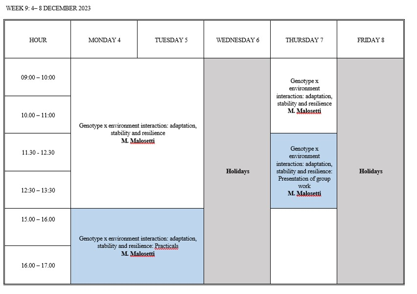

--- 
title: "Genotype by environment interaction: adaptation, stability and resilience"
author: "Marcos Malosetti"
date: "`r Sys.Date()`"
site: bookdown::bookdown_site
documentclass: book
bibliography: [book.bib, packages.bib]
description: |
  This is the base document used in the Zaragoza course 2023.
---

# The module at a glance {-}


```{r, echo=FALSE, out.width="90%", fig.align="center"}

```


```{r, include=FALSE}
# set the environment
library(tidyverse)
library(lme4)
library(lmerTest)
library(lattice)
library(emmeans)
library(reactable)
library(GGally)
library(ggrepel)
library(GGEBiplots)
library(plotly)

```

